# TenPayGo 接入 · 设计说明（供同步到 appearance.pen）

v1 · 2026-10-06 · 本次按决策 D2 没有改 `appearance.pen` 和 `h5/index.html`，新增界面都由 `h5/app.js` 在运行时生成。下次在 pen.dev 改设计稿时，按本文把它们补进设计稿，然后删掉 `app.js` 里对应的注入代码。

截图来自本地端到端运行（`img/`），时间和分钟数是测试时的真实时钟，不是设计值。

---

## 1. 行前检查 · Payment in China 板块

| 未验证 | 选择层 | 已验证一种 | 两种都验证 |
|---|---|---|---|
| 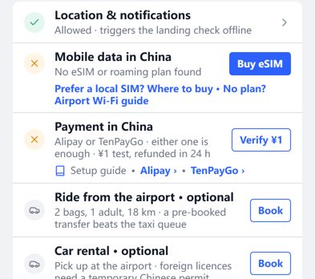 | 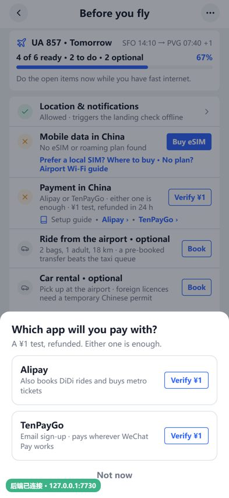 | 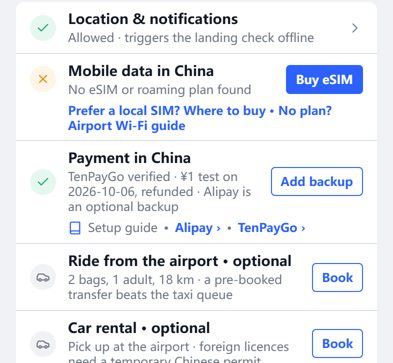 | 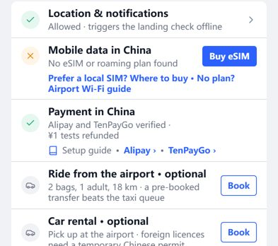 |

需求方 2026-10-06 反馈："这两个板块收成一个境内支付即可，下方不用特意强调 animation"。原来的"Alipay payment""TenPayGo payment"两行合成一个板块：

- **结构**：沿用设计稿的 `Item Alipay payment` 节点（节点名不改，`build_h5.py` 的绑定不用动），标题改为 `Payment in China`。不再有单独的 TenPayGo 行。
- **状态图标**：任一种验证过为绿色 ✓，否则橙色 ✕。不再需要"备用"图标。
- **按钮**（动作 `api:paypick`）：
  - 都没验证：`Verify ¥1`，弹出选择层（标题 `Which app will you pay with?`，两个选项与落地流程的选择层相同）。
  - 已验证一种：`Add backup`，直接验证另一种，不弹选择层。
  - 两种都验证：隐藏。
- **说明文字**由后端 `/rules/preflight` 的 `payment.desc` 给出（PRD §6）。
- **教程入口**：板块下方一行 `Setup guide · Alipay › · TenPayGo ›`，两个链接分别打开两篇设置教程；不写截图或动画的数量。

## 2. 验证结果页 · TenPayGo 版本

| 成功 | 失败（ISSUER_DECLINED） |
|---|---|
| 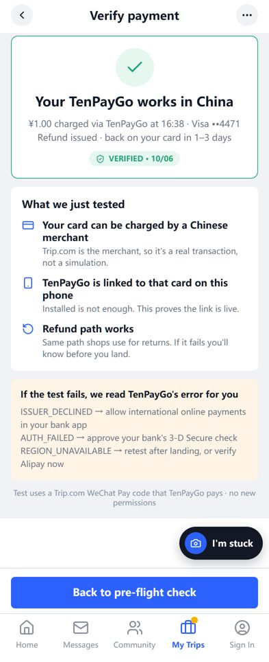 | 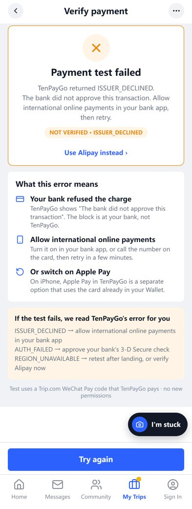 |

- 与支付宝版共用一屏，只换文案：标题、副标题、"What we just tested"第 2 条、失败说明卡、来源小字。
- **新增 `Pay Switch`**：失败时出现在结果卡片内、状态胶囊下方，13px / 600 / `#2C61FE`，居中，上边距 12px。文案 `Use Alipay instead ›` 或 `Use TenPayGo instead ›`。底栏是横排，放不下第二个按钮，所以放进卡片。
- **修正**：结果卡片描边是 `outline`，失败时应改 `outline-color: #E8890C`（原代码改的是 `border-color`，没有生效，支付宝失败页同样受影响，本次一并修正）。

## 3. 选择层 · 先验证支付

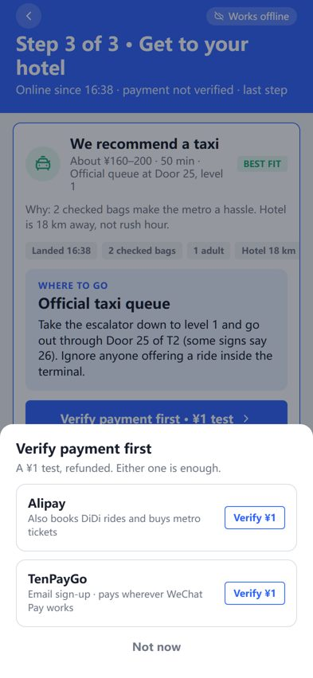

- 节点名 `Pay Chooser`。全屏遮罩 `rgba(18,24,38,.45)`，底部白色面板，顶部圆角 16，内边距 20 / 20 / 30。
- 标题 `Verify payment first` 17px / 700；副标题 `A ¥1 test, refunded. Either one is enough.` 13px / `#6F7685`。
- 两个选项卡：描边 `#DADFE6`、圆角 12、内边距 14，左侧名称 15px / 700 + 一行说明 12px，右侧 `Verify ¥1` 描边按钮（与行前检查一致）。
  - Alipay · `Also books DiDi rides and buys metro tickets`
  - TenPayGo · `Email sign-up · pays wherever WeChat Pay works`
- 底部 `Not now` 14px / 600 / `#6F7685`，点遮罩空白处同样关闭。
- 出现场景：Wi-Fi 引导页、已联网页、第三步的主按钮在支付未就绪时。

## 4. 落地后各页的文案

| 第三步 | My Trips | 完成页 |
|---|---|---|
| 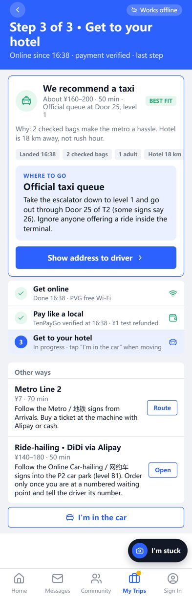 | 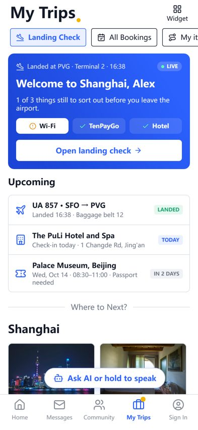 | 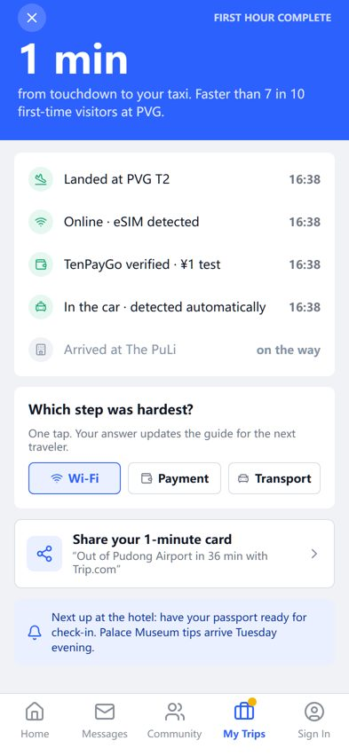 |

| 位置 | 设计稿现文案 | 改为 |
|---|---|---|
| 进度列表第二行 Step Desc | Verified before you flew · ¥1 test refunded | `{Alipay|TenPayGo} verified before you flew · ¥1 test refunded`；落地当天验证的为 `… verified at HH:MM · …`；未验证 `Not verified yet · ¥1 test with Alipay or TenPayGo` |
| My Trips 第二个标签 `Pill Alipay` | Alipay | 已验证的方式名；都没验证时 `Payment`。节点名保留 `Pill Alipay` 以免改绑定 |
| 完成页 `Event Payment verified before flight` | Payment verified before flight | `{方式} verified before flight` / `{方式} verified · ¥1 test` |

### 只验证了 TenPayGo 时的交通提示（PRD FR-12）

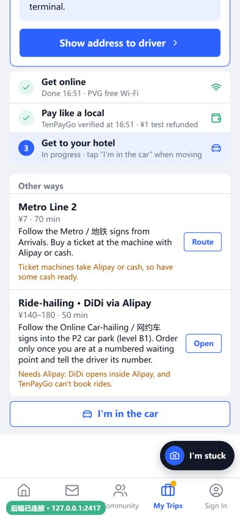

- 在推荐卡片的 WHERE TO GO 区块末尾、以及 Other ways 每一行地址下方，加一行 12px / `#B25E00` 的提示，上边距 6px。
- 只出现在两种方式上：支付宝里的滴滴（Needs Alipay…）、地铁售票机（No Alipay verified: have some cash…）。验证了支付宝后不显示。

## 5. 图文教程

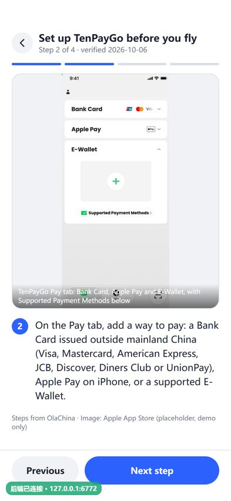

沿用现有教程屏。第 2、4 步配图是 App Store 官方截图裁出的手机画面（宽 480），标 placeholder，正式版换成自己截的图。

**第 1 步是自制动画**（不是占位图）：App Store 里搜索 TenPayGo → Get → 进度环 → Open，8 秒循环，720×816（与教程框同比例），145 KB 的 MP4 加 65 KB 的封面 PNG。界面全部自绘，源工程和重新出片的命令在 `demo/motion/tenpaygo-appstore-download/`。教程屏对视频配图用 `<video muted loop autoplay playsinline>`，离开教程屏时暂停。

## 6. 不改的地方

第三步「Ride-hailing · DiDi via Alipay」、地铁导航「Buy a ticket … with Alipay or cash」、给司机看页「Order a DiDi via Alipay」保持不变：TenPayGo 没有小程序，也没有证据显示能在地铁售票机付款（见 `01-需求调研.md` §6）。
