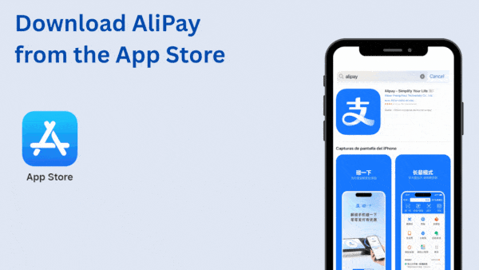
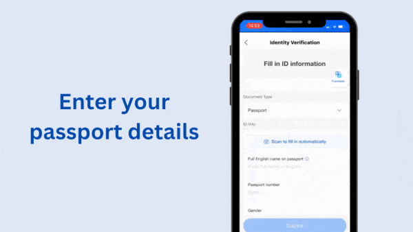
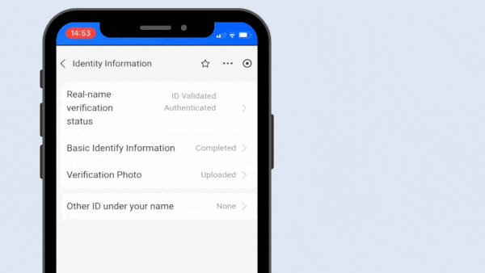
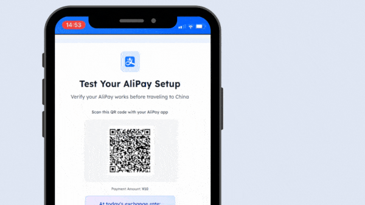

# readyforchina.com 支付宝设置教程（iOS / Android）

来源：<https://www.readyforchina.com/en/alipay> 页面 "Setup guide" 区块。页面用 Tab 切换 iOS / Android，服务端 HTML 只渲染 iOS，Android 文案取自页面内嵌的 i18n JSON，动图路径取自前端 JS 包。

动图原文件在 `gifs/`。站点只做了 1 张 Android 专属动图（Google Play 下载），Android 第 2 到 6 步在源码里直接复用 iOS 的动图，所以 Android 的图和文字对不上（例如第 3 步文字是绑卡，图却是 iOS 的实名认证）。

中文为翻译，仅供内部参考；英文是原文。

## iOS

### Step 1. Download from App Store

Install the official AliPay app from the iOS App Store - ensure it's by Alipay (Hangzhou) Technology Co., Ltd.

> 从 App Store 下载：在 iOS App Store 安装官方 AliPay 应用，确认开发者是 Alipay (Hangzhou) Technology Co., Ltd.。

### Step 2. Sign Up with Mobile

Tap 'Register' and use your international mobile number for account creation.

> 用手机号注册：点 'Register'，用你的国际手机号创建账号。

### Step 3. Verify Identity

Navigate to 'Account' → 'Settings' (the gear icon) → 'Account and Security' → 'Identity Verification' and upload your passport photo and a selfie.

> 实名认证：进入 'Account' → 'Settings'（齿轮图标）→ 'Account and Security' → 'Identity Verification'，上传护照照片和一张自拍。

### Step 4. Await Verification

Verification usually takes a few minutes, you can check if its completed by 'Account' → 'Settings' (the gear icon) → 'Account and Security' → 'Identity Information'

> 等待审核：审核通常几分钟完成，可在 'Account' → 'Settings'（齿轮图标）→ 'Account and Security' → 'Identity Information' 查看是否通过。

### Step 5. Link Your Card

Navigate to 'Account' → 'Settings' → 'Bank Cards' → '+' to add your international credit/debit card.

> 绑定银行卡：进入 'Account' → 'Settings' → 'Bank Cards' → '+'，添加你的国际信用卡/借记卡。

### Step 6. Test your Payment

To make sure your AliPay is working, you can test it by clicking the button below.

> 测试支付：为确认 AliPay 可用，点页面下方按钮做一次测试支付。

## Android

### Step 1. Download from Google Play

Install the official AliPay app from the Google Play Store - search for 'AliPay' and look for the official app by Alipay (Hangzhou) Technology Co., Ltd.

> 从 Google Play 下载：在 Google Play 搜索 'AliPay'，安装 Alipay (Hangzhou) Technology Co., Ltd. 的官方应用。

### Step 2. Create Account with Phone

（复用 iOS 动图）

Open AliPay and tap 'Sign Up'. Use your international phone number to create an account.

> 用手机号创建账号：打开 AliPay 点 'Sign Up'，用你的国际手机号创建账号。

### Step 3. Add International Card

（复用 iOS 动图）

Go to 'Cards & Banks' → 'Add Card' and link your international Visa/Mastercard.

> 添加国际银行卡：进入 'Cards & Banks' → 'Add Card'，绑定国际 Visa/Mastercard。

### Step 4. Complete ID Verification

（复用 iOS 动图）

Upload photos of your passport and take a selfie for identity verification.

> 完成实名认证：上传护照照片并自拍，完成身份验证。

### Step 5. Set Up Payment PIN

（复用 iOS 动图）

Create a 6-digit payment PIN and enable fingerprint/face unlock for faster payments.

> 设置支付密码：设置 6 位支付 PIN，并开启指纹/人脸解锁以便快速支付。

### Step 6. Enable Overseas Features

（复用 iOS 动图）

In Settings → Payment Settings, enable 'Overseas Payment' for international card usage.

> 开启境外功能：在 Settings → Payment Settings 里开启 'Overseas Payment'，以便使用国际卡。

## 动图与步骤对应（取自 JS 包）

| 平台 | 步骤 | 文件 | 原始地址 |
|---|---|---|---|
| iOS | 1 | gifs/iosStep1.gif | https://www.readyforchina.com/gifs/iosStep1.gif |
| iOS | 2 | gifs/iosStep2.gif | https://www.readyforchina.com/gifs/iosStep2.gif |
| iOS | 3 | gifs/iosStep3.gif | https://www.readyforchina.com/gifs/iosStep3.gif |
| iOS | 4 | gifs/iosStep4.gif | https://www.readyforchina.com/gifs/iosStep4.gif |
| iOS | 5 | gifs/iosStep5.gif | https://www.readyforchina.com/gifs/iosStep5.gif |
| iOS | 6 | gifs/iosStep6.gif | https://www.readyforchina.com/gifs/iosStep6.gif |
| Android | 1 | gifs/androidStep1.gif | https://www.readyforchina.com/gifs/androidStep1.gif |
| Android | 2 | gifs/iosStep2.gif | https://www.readyforchina.com/gifs/iosStep2.gif |
| Android | 3 | gifs/iosStep3.gif | https://www.readyforchina.com/gifs/iosStep3.gif |
| Android | 4 | gifs/iosStep4.gif | https://www.readyforchina.com/gifs/iosStep4.gif |
| Android | 5 | gifs/iosStep5.gif | https://www.readyforchina.com/gifs/iosStep5.gif |
| Android | 6 | gifs/iosStep6.gif | https://www.readyforchina.com/gifs/iosStep6.gif |
